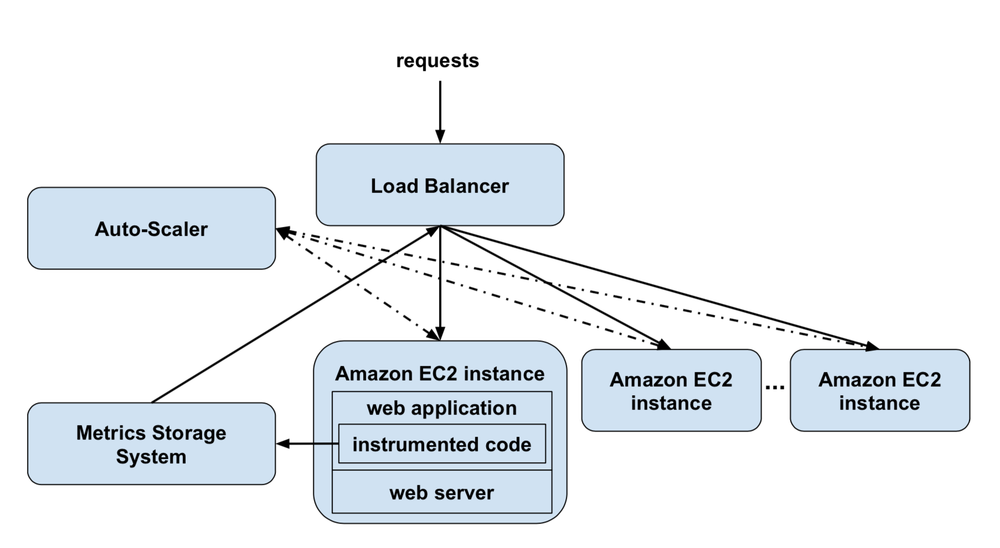

# CloudPrime

A web server elastic cluster that performs CPU-intensive calculations on-demand. The CloudPrime system receive a stream of web requests and it should run within the Amazon Web Services ecosystem. Each request is for a calculation that is CPU-intensive, and that can have a varying duration. To have good performance and efficiency, the system will have to optimize the selection of the cluster node for each incoming request and to optimize the number of active nodes in the cluster.

The system is organized in four main components:

 - `Web Servers`: The web servers receive web requests to perform calculations, run them and return the results. In the CloudPrime system, there will be a varying number of identical web servers. Each one of them will run on a rented AWS Elastic Compute Cloud (EC2) machine.

 - `Load Balancer`: The load balancer is the entry point into the CloudPrime system. It receives all web requests, and for each one, it selects an active web server to serve the request and forwards it to that server.
 
 - `Auto-Scaler`: The auto-scaler is in charge of collecting system performance metrics and, based on them, adjusting the number of active web servers.
 
 - `Metrics Storage System`: The metrics storage system will use one of the available data storage mechanism at AWS to store web server performance metrics. These will help the load balancer choose the most appropriate web server.

### Code Instrumentation

The code of the application that performs the integer factoring (called by the web server) is written in the Java programming language and compiled into bytecode. The integer factoring code uses a recursive algorithm. The application should further be instrumented with a Java instrumentation tool (such as BIT) in order to extract and persistently store the dynamic performance metrics regarding the code executed. 
